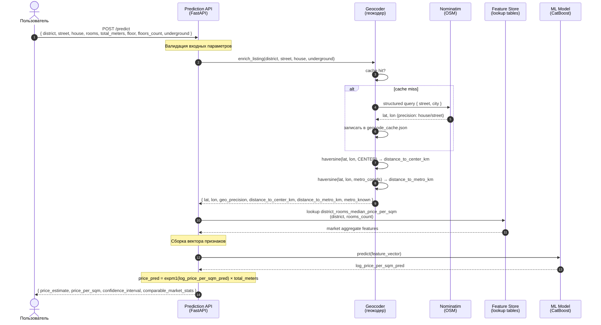
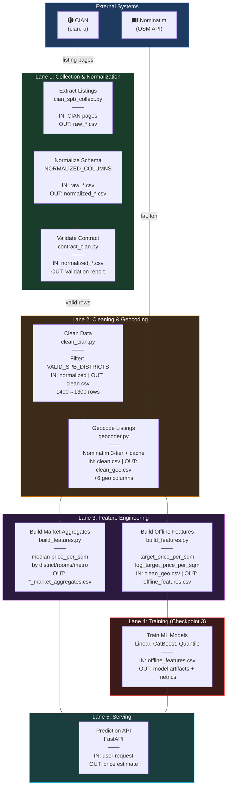
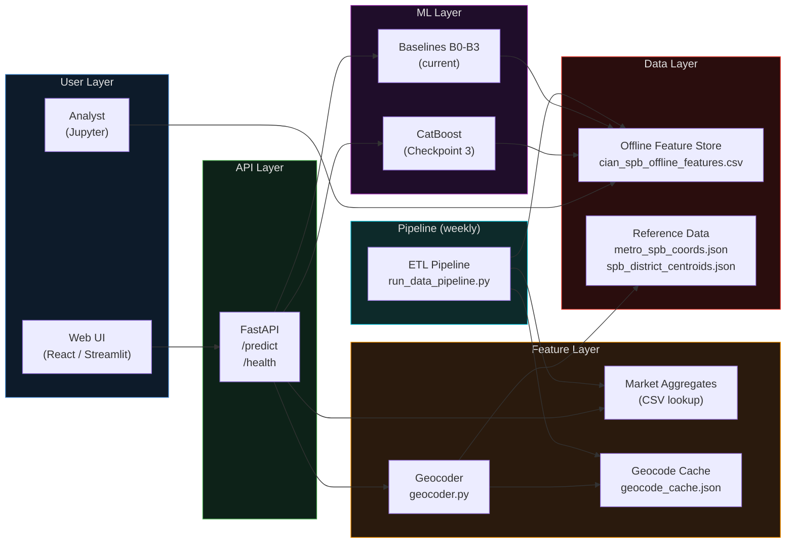

# CIAN Price Intelligence — Architecture Diagrams

## 1. Inference Flow (Sequence Diagram)

Sequence diagram shows the runtime request path when a user requests a price estimate.

---

## 2. Data Pipeline (BPMN Swimlane)

BPMN-style swimlane diagram of the weekly ETL pipeline.

---

## 3. System Architecture Layers

