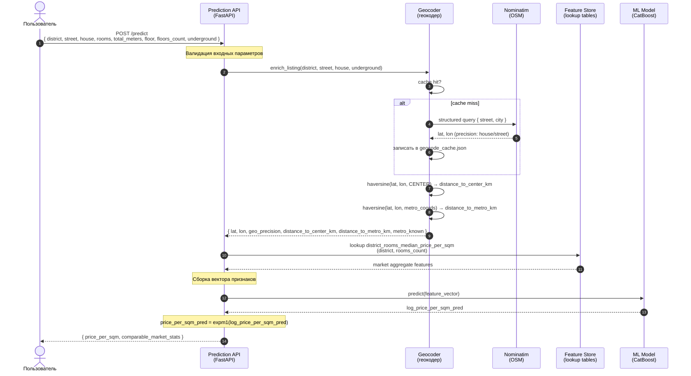
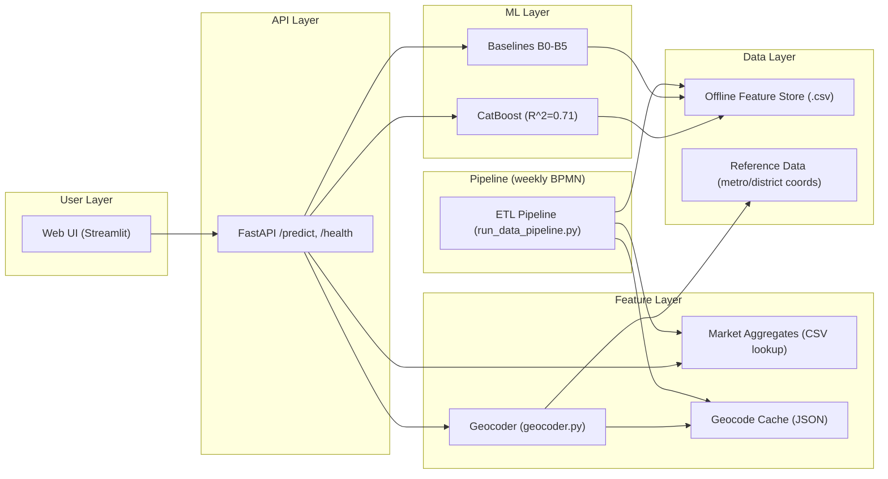

# CIAN Price Intelligence — BPMN Architecture Diagrams

## Основная BPMN-диаграмма

**BPMN 2.0 XML:** [docs/diagrams/cian_data_pipeline.bpmn](diagrams/cian_data_pipeline.bpmn)

Файл открывается в [demo.bpmn.io](https://demo.bpmn.io/) — загрузите XML, чтобы увидеть диаграмму в нотации BPMN 2.0.

---

## 1. BPMN Data Pipeline (схема процесса)

**Pool:** CIAN Price Intelligence System  
**Стартовое событие:** Timer (еженедельный запуск)  
**Завершающее событие:** Пайплайн завершён

### Дорожки (Lanes)

| Lane | Задачи (Tasks) | Вход | Выход |
|---|---|---|---|
| **Lane 1: Сбор и очистка** | Collect → Normalize → Validate → Gateway → Clean | CIAN pages | clean.csv (1300 rows) |
| **Lane 2: Геокодинг и признаки** | Geocode → GeoFeatures → BuildFeatures → Aggregates | clean.csv | offline_features.csv + 5 aggregate tables |
| **Lane 3: Обучение** | Split → Ridge → CatBoost → Gateway → SaveModel | offline_features.csv | catboost_price_per_sqm.cbm |
| **Lane 4: Семплирование** | Sampling | clean.csv | balanced_sample.csv (1275 rows) |

### Шлюзы (Gateways)

| Gateway | Тип | Условие | Действие |
|---|---|---|---|
| Контракт пройден? | Exclusive | passed | → Clean |
| Контракт пройден? | Exclusive | failed | → FixContract → Validate |
| R² > 0.31 (B2)? | Exclusive | yes | → SaveModel → End |
| R² > 0.31 (B2)? | Exclusive | no | → TuneHyper → CatBoost |

### Объекты данных (Data Objects)

| Data Object | Файл |
|---|---|
| Raw listings | `cian_spb_raw.csv` |
| Normalized | `cian_spb_normalized.csv` |
| Clean | `cian_spb_clean.csv` (1300 rows) |
| Geocoded | `cian_spb_clean_geo.csv` (+6 geo columns) |
| Features | `offline_features.csv` (18 features) |
| Aggregates | `*_market_aggregates.csv` (5 tables) |
| Model | `catboost_price_per_sqm.cbm` |
| Balanced sample | `balanced_sample.csv` (1275 rows) |

### Визуализация BPMN (Mermaid)

```mermaid
flowchart TB
    Start([Timer: еженедельный запуск]) --> P1

    subgraph Lane1["<b>Lane 1: Сбор и очистка данных</b>"]
        P1[Сбор объявлений CIAN<br/>cianparser, 5 сегментов]
        P2[Нормализация схемы<br/>24 колонки, дедупликация]
        P3[Валидация Data Contract<br/>Great Expectations]
        G1{Контракт<br/>пройден?}
        P4[Очистка данных<br/>Whitelist 18 районов СПб]
        P3Fix[Исправление нарушений]
    end

    P1 --> P2 --> P3 --> G1
    G1 -->|passed| P4
    G1 -->|failed| P3Fix --> P3

    subgraph Lane2["<b>Lane 2: Геокодинг и признаки</b>"]
        P5[Геокодинг адресов<br/>Nominatim 3-tier + JSON-кэш]
        P6[Расчёт гео-признаков<br/>distance_to_center_km<br/>distance_to_metro_km]
        P7[Сборка offline-фичей<br/>18 признаков, target_price_per_sqm]
        P8[Market aggregates<br/>5 lookup-таблиц]
    end

    P4 --> P5 --> P6 --> P7 --> P8

    subgraph Lane3["<b>Lane 3: Обучение моделей</b>"]
        P9[Train/val/test split<br/>60/20/20, stratify rooms]
        P10[Ridge baseline<br/>StandardScaler + OHE]
        P11[Обучение CatBoost<br/>5-fold CV, early stopping]
        G2{R² > 0.31<br/>(выше B2)?}
        P12[Сохранение модели<br/>catboost .cbm]
        P13[Подбор гиперпараметров]
    end

    P8 --> P9 --> P10 --> P11 --> G2
    G2 -->|yes| P12 --> Stop([Пайплайн завершён])
    G2 -->|no| P13 --> P11

    subgraph Lane4["<b>Lane 4: Семплирование</b>"]
        P14[Stratified sampling<br/>по rooms_count<br/>1275 строк]
    end

    P4 --> P14

    %% Data Objects
    D1[(Raw CSV)]
    D2[(Normalized CSV)]
    D3[(Clean CSV<br/>1300 rows)]
    D4[(Geo CSV<br/>+6 columns)]
    D5[(Offline Features<br/>18 features)]
    D6[(Aggregate Tables<br/>5 files)]
    D7[(Model .cbm)]
    D8[(Balanced Sample)]

    P1 --- D1
    P2 --- D2
    P4 --- D3
    P6 --- D4
    P7 --- D5
    P8 --- D6
    P12 --- D7
    P14 --- D8

    style Start fill:#4caf50,color:#fff
    style Stop fill:#f44336,color:#fff
    style G1 fill:#ff9800,color:#fff
    style G2 fill:#ff9800,color:#fff
    style Lane1 fill:#e8f5e9,stroke:#4caf50
    style Lane2 fill:#fff3e0,stroke:#ff9800
    style Lane3 fill:#e3f2fd,stroke:#2196f3
    style Lane4 fill:#f3e5f5,stroke:#9c27b0
```

---

## 2. Inference Flow (Sequence Diagram)

Диаграмма последовательности для runtime-запроса `/predict`.



---

## 3. System Architecture Layers


