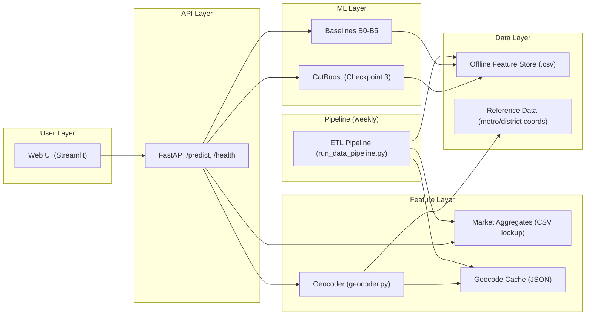

# CIAN Price Intelligence — Architecture

## BPMN-диаграмма (основная)

**BPMN 2.0 XML:** [docs/diagrams/cian_data_pipeline.bpmn](diagrams/cian_data_pipeline.bpmn) — открыть в [demo.bpmn.io](https://demo.bpmn.io/)

Полное описание BPMN-процесса (пулы, дорожки, задачи, шлюзы, объекты данных): [docs/architecture_bpmn.md](architecture_bpmn.md).

## System Architecture Overview

The system has six layers:

## Data Flow

See [docs/dfd_checkpoint2.md](dfd_checkpoint2.md) for the detailed Data Flow Diagram.

## Pipeline Stages

1. **Extract** — CIAN listing pages → raw CSV snapshots
2. **Normalize** — raw parser output → stable normalized schema
3. **Validate** — data contract check via `contract_cian.py`
4. **Clean** — broken-row filter by `VALID_SPB_DISTRICTS`, outlier removal
5. **Geocode** — Nominatim with 3 precision tiers (house/street/district) + cache
6. **Feature Engineering** — offline feature table + market aggregate lookups
7. **Sampling** — stratified balanced sample by rooms_count
8. **Train** — Ridge baseline + CatBoost model
9. **Serve** — FastAPI prediction endpoint + Streamlit UI

## Technology Choices

| Component | Tool | Rationale |
|---|---|---|
| Data Collection | cianparser | existing CIAN parser, sufficient for MVP |
| ETL | pandas, Python modules | simple local pipeline, reproducible |
| Storage | CSV + JSON | transparent, no infrastructure cost |
| Geocoding | geopy (Nominatim) | free, no API key, persistent cache |
| ML (baseline) | scikit-learn Ridge | linear baseline, fast training |
| ML (main) | CatBoost | handles categoricals, NaN, non-linearity natively |
| API | FastAPI | fast, auto-docs, Python-native |
| UI | Streamlit | rapid web UI, Python-native |
