# DFD - Checkpoint 2 Data Flow

```mermaid
flowchart LR
    UserOps[Project Team] -->|run pipeline| Pipeline[Pipeline Orchestrator]

    CIAN[External Entity: CIAN] -->|listing pages| P1[Process 1: Extract Listings]
    P1 -->|raw parser output| D1[(Data Store: Raw Snapshots)]

    D1 --> P2[Process 2: Normalize Schema]
    P2 -->|normalized listings| D2[(Data Store: Normalized Snapshots)]

    D2 --> P3[Process 3: Validate Data Contract]
    P3 -->|validation status| R1[Validation Report]
    P3 -->|valid data| P4[Process 4: Clean Data with whitelist filter]

    P4 -->|clean listings| D3[(Data Store: Clean Dataset)]

    D3 --> P5[Process 5: Geocode Listings]
    Nominatim[External Entity: OSM Nominatim] -->|address lookup| P5
    P5 -->|persisted lookups| D7[(Geocode Cache + Metro / District Reference)]
    D7 --> P5
    P5 -->|listings with lat, lon, distances| D3G[(Data Store: Geocoded Dataset)]

    D3G --> P6[Process 6: Feature Engineering]
    P6 -->|listing-level features + per-sqm target| D4[(Offline Feature Store)]
    P6 -->|market aggregate lookups| D5[(Online Feature Lookup Tables)]
    P6 -->|feature metadata| R2[Feature Registry]

    D3 --> P7[Process 7: Stratified Sampling]
    P7 -->|balanced sample| D6[(Balanced Dataset)]
    P7 -->|sampling summary| R3[Sampling Report]

    D4 --> FutureTrain[Future Process: Model Training]
    D5 --> FutureAPI[Future Process: Prediction API]
    D7 --> FutureAPI
```

## Data Stores

| Store | Description |
|---|---|
| Raw Snapshots | unmodified CIAN parser outputs |
| Normalized Snapshots | stable project schema with selected fields |
| Clean Dataset | validated and cleaned model-ready listing data after broken-row whitelist filter |
| Geocoded Dataset | clean listings enriched with `lat, lon, geo_precision, distance_to_center_km, distance_to_metro_km, metro_known` |
| Geocode Cache + Metro / District Reference | persisted `data/cache/geocode_cache.json`, `data/reference/metro_spb_coords.json`, `data/reference/spb_district_centroids.json` — also reused at serving time so the prediction API never depends on a live Nominatim call for known addresses |
| Offline Feature Store | training feature matrix with `target_price_per_sqm` and `log_target_price_per_sqm` |
| Online Feature Lookup Tables | aggregate market features for serving |
| Balanced Dataset | room-balanced sample for analysis and experiments |

## Difference From Architecture Diagram

The architecture diagram shows system components and future serving/training
blocks. This DFD focuses specifically on how data moves between processes and
stores in Checkpoint 2 after the 2026-05-06 update that added the geocoding
step and switched the modeling target to `price_per_sqm`.
