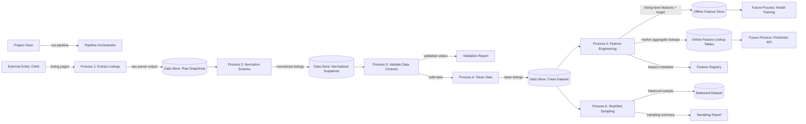

# DFD - Checkpoint 2 Data Flow

## Data Stores

| Store | Description |
|---|---|
| Raw Snapshots | unmodified CIAN parser outputs |
| Normalized Snapshots | stable project schema with selected fields |
| Clean Dataset | validated and cleaned model-ready listing data |
| Offline Feature Store | training feature matrix with targets |
| Online Feature Lookup Tables | aggregate market features for serving |
| Balanced Dataset | room-balanced sample for analysis and experiments |

## Difference From Architecture Diagram

The architecture diagram shows system components and future serving/training
blocks. This DFD focuses specifically on how data moves between processes and
stores in Checkpoint 2.
